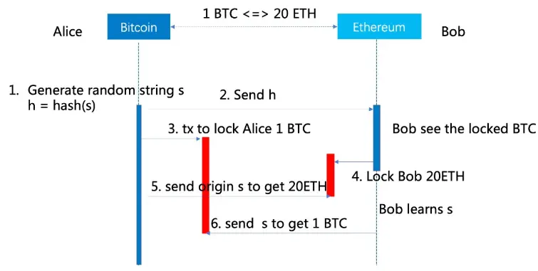

# hashed-timelock-contract-dapp
A dAPP for hashed timelock contract

## Environment
`Truffle v5.5.4`    
`Solidity: 0.8.12`  
`Ganache v7.0.3`    
`Node v17.7.1`  

## Usuage

### Install
`npm install`

### Start test network
`npm run ganache-start`

### Run contract unit tests
`npm run test-contracts`

### Serve web page
`npm run serve-web`

## A workflow diagram of cross chain transaction with Hashed Timelock Contract

## TODOs
- Add components/functions to implement atomic swap between tokens with HTLC to the web page/app. It only shows the HTLC workflow design diagram for now. 
- Improve unit test coverage.
- Add support for more token standard, e.g. ERC721.
